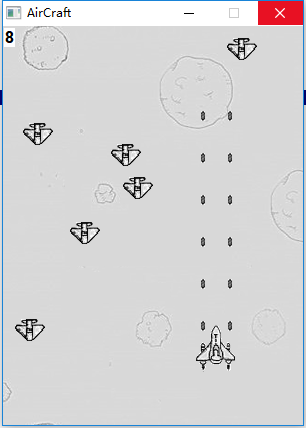
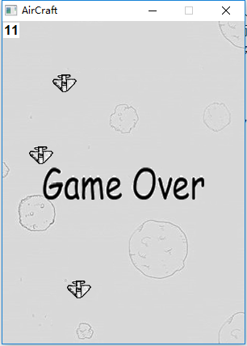

# AirCraft

### 介绍

这是我早年刚入门 C 时候写的一个小游戏。记得我是看翁恺老师的C语言课入的门，感谢翁恺老师，让我觉得编程特别有意思。而且翁恺老师在课程中介绍了浙大了一个windows开发框架ACLLIB，让我这种一开始对界面程序特别好奇的人能够写一些简单的windows图形界面程序，而不用去学习那些复杂的windows API，MFC等等。

### 游戏截图

### 说明

资源文件在`output/data`目录下，如果想直接体验游戏内容，可以直接运行`output/aircraft.exe`。

`main.c`是主函数，`aircraft.h`是库函数，总共300行左右。

其中用到acllib框架，包括两个文件：`acllib.h`，`acllib.c`，框架由浙江大学开发。

### 编译运行

#### 1. 使用 Visual Studio

课程中使用的是Dev-c++，然而在windows下使用visual studio会更加方便，这样就不用导入额外的库了。

用VS打开项目文件`Aircraft.sln`，然后生成解决方案，建议使用VS2015及以上版本，这样可以保证兼容。

#### 2. 使用 GCC / Dev-c++

使用gcc编译的话，可以参考`Aircraft/makefile`，不进行详述。

如果希望使用Dev-c++，并对此有困惑的同学，可以发邮件至`dfzszpzq@qq.com`进行询问。

